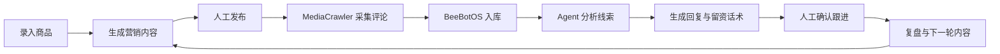
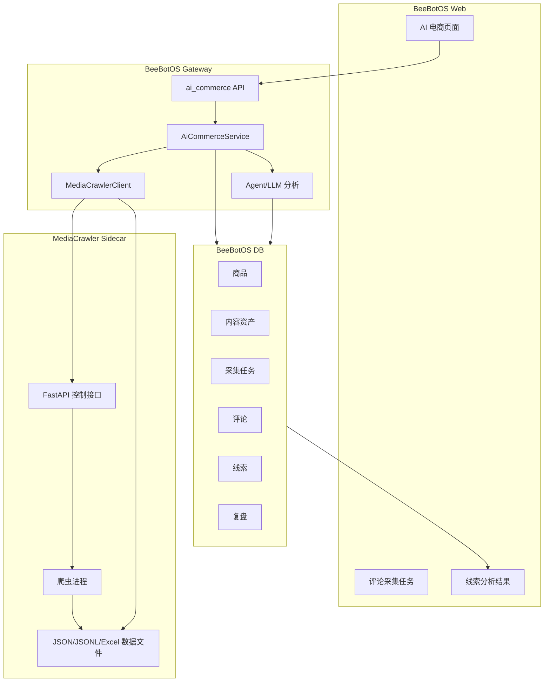

# AI 电商 Agent 评论线索闭环设计

## 一、核心结论

第一阶段建议把 AI 电商模块升级为“单品营销 + 评论线索雷达”。

完整链路是：



这条链路不依赖淘宝、抖店、京东、拼多多等店铺 API。第一版只采集用户自己发布内容下的评论，用 AI 做评论分析、线索分级、回复建议和后续复盘。

MediaCrawler 负责“采集评论”，BeeBotOS 负责“任务管理、数据沉淀、AI 分析、运营闭环”。

## 二、定位

这个模块不是单纯的 AI 文案工具，也不是全平台店铺管理后台。

它的定位是：

> 围绕一个商品，帮助用户生成营销内容，追踪发布后的评论反馈，从评论中识别潜在线索，并沉淀为可复盘、可跟进的运营资产。

通用大模型可以写文案，但默认不会持续维护商品、计划、评论、线索、回复、复盘这些业务对象。BeeBotOS 的价值在于把这些对象串成一个可运行的 Agent 工作流。

## 三、为什么接入 MediaCrawler

当前电商平台官方 API 接入成本高，且不同平台授权规则、费用、审核周期不一致。直接做多平台店铺 API 接入，短期风险较高。

MediaCrawler 已支持小红书、抖音、快手、B 站、微博、贴吧、知乎等平台的内容和评论采集，适合用于个人项目和内部验证“评论区线索雷达”。

需要注意：

- MediaCrawler 的许可证是 `NON-COMMERCIAL LEARNING LICENSE 1.1`。
- 适合个人学习、研究和非商业项目验证。
- 不建议把 MediaCrawler 代码直接合并进 BeeBotOS 核心仓库。
- 不建议用于大规模爬取。
- 不建议绕过平台规则做自动化批量营销。

因此，第一版采用本地 Sidecar 接入方式。

## 四、总体架构



## 五、MediaCrawler 接入方式

### 1. 运行方式

MediaCrawler 作为独立本地服务运行，例如：

```bash
uv run uvicorn api.main:app --host 127.0.0.1 --port 8088
```

BeeBotOS 不直接 import MediaCrawler 代码，而是通过 HTTP 调用它的 API。

### 2. 可用接口

MediaCrawler 自带 FastAPI 控制层，可复用以下接口：

| 接口 | 作用 |
|---|---|
| `POST /api/crawler/start` | 启动采集任务 |
| `POST /api/crawler/stop` | 停止采集任务 |
| `GET /api/crawler/status` | 查看采集状态 |
| `GET /api/crawler/logs` | 查看采集日志 |
| `GET /api/data/files` | 查看采集结果文件 |
| `GET /api/data/files/{path}` | 预览采集结果 |

### 3. 第一版采集模式

第一版只使用 `detail` 模式，采集指定内容链接下的评论。

不优先做关键词搜索模式，避免扩大采集范围。

推荐支持平台：

| 平台 | MediaCrawler 代号 | 第一版优先级 |
|---|---|---|
| 小红书 | `xhs` | 高 |
| 抖音 | `dy` | 高 |
| B 站 | `bili` | 中 |
| 微博 | `wb` | 中 |

第一版建议先接小红书和抖音。

## 六、业务链路

### 1. 商品录入

用户录入一个商品：

- 商品名称
- 价格区间
- 核心卖点
- 目标人群
- 使用场景
- 禁用词
- 参考素材

系统保存为商品档案，作为后续内容生成和评论分析的上下文。

### 2. 营销内容生成

Agent 生成多平台内容：

- 小红书种草文
- 抖音短视频脚本
- 朋友圈文案
- 直播口播
- 客服 FAQ
- 评论区引导话术

内容保存为资产，状态包括：

- `draft`：草稿
- `approved`：已确认
- `published`：已发布
- `archived`：归档

### 3. 人工发布

用户把内容发布到对应平台。

系统记录：

- 发布平台
- 发布链接
- 关联商品
- 关联内容资产
- 发布时间

第一版不做自动发布。

### 4. 评论采集任务

用户在 AI 电商页面输入已发布链接，点击“采集评论”。

BeeBotOS 创建采集任务，并调用 MediaCrawler：

```json
{
  "platform": "xhs",
  "login_type": "qrcode",
  "crawler_type": "detail",
  "specified_ids": "https://www.xiaohongshu.com/explore/xxx",
  "enable_comments": true,
  "enable_sub_comments": false,
  "save_option": "jsonl",
  "headless": false
}
```

第一次运行可能需要扫码登录，这属于预期行为。

### 5. 评论入库

MediaCrawler 采集完成后，BeeBotOS 拉取结果文件并解析评论。

评论入库字段建议包括：

- 平台
- 内容链接
- 评论 ID
- 评论内容
- 评论用户昵称
- 评论时间
- 点赞数
- 父评论 ID
- 原始数据 JSON

第一版不强依赖用户唯一身份，只保存评论分析所需信息。

### 6. AI 线索分析

Agent 基于商品档案和评论内容做分析：

- 是否有购买意向
- 是否询价
- 是否询问使用场景
- 是否表达顾虑
- 是否有负面反馈
- 是否出现联系方式
- 是否适合引导私信
- 推荐回复话术

线索等级：

| 等级 | 含义 |
|---|---|
| A | 明确购买意向，如询价、问怎么买、问链接 |
| B | 有兴趣但存在疑虑，如问效果、适用人群、售后 |
| C | 普通互动或弱兴趣 |
| D | 负面反馈或无效评论 |

### 7. 回复与留资建议

系统不直接自动私信或自动外呼。

Agent 生成建议：

- 评论公开回复
- 私信引导话术
- 客服承接话术
- 是否建议引导用户主动留资

如果评论中出现手机号、微信号等联系方式，第一版只标记为“待人工确认”，不自动触达。

### 8. 跟进与复盘

用户手动标记跟进结果：

- 已回复
- 已私信
- 已留资
- 已成交
- 无效

Agent 汇总复盘：

- 哪类内容更容易带来高意向评论
- 用户最关心的问题
- 商品卖点是否需要调整
- 下一轮内容应该强化什么
- 是否需要更新 FAQ 和客服话术

## 七、数据模型建议

### 1. 商品表

`commerce_products`

| 字段 | 说明 |
|---|---|
| `id` | 商品 ID |
| `name` | 商品名称 |
| `price_range` | 价格区间 |
| `selling_points` | 卖点 |
| `target_audience` | 目标人群 |
| `scenarios` | 使用场景 |
| `forbidden_words` | 禁用词 |
| `created_at` | 创建时间 |
| `updated_at` | 更新时间 |

### 2. 内容资产表

`commerce_content_assets`

| 字段 | 说明 |
|---|---|
| `id` | 内容 ID |
| `product_id` | 商品 ID |
| `platform` | 平台 |
| `content_type` | 内容类型 |
| `title` | 标题 |
| `body` | 正文 |
| `status` | 状态 |
| `published_url` | 发布链接 |
| `created_at` | 创建时间 |

### 3. 评论采集任务表

`commerce_comment_crawl_jobs`

| 字段 | 说明 |
|---|---|
| `id` | 任务 ID |
| `product_id` | 商品 ID |
| `content_asset_id` | 内容资产 ID |
| `platform` | 平台 |
| `source_url` | 发布链接 |
| `status` | `pending/running/succeeded/failed` |
| `mediacrawler_file_path` | MediaCrawler 结果文件 |
| `error_message` | 错误信息 |
| `created_at` | 创建时间 |
| `completed_at` | 完成时间 |

### 4. 评论表

`commerce_comments`

| 字段 | 说明 |
|---|---|
| `id` | 评论 ID |
| `job_id` | 采集任务 ID |
| `platform` | 平台 |
| `external_comment_id` | 平台评论 ID |
| `author_name` | 评论用户昵称 |
| `content` | 评论内容 |
| `like_count` | 点赞数 |
| `commented_at` | 评论时间 |
| `raw_json` | 原始数据 |

### 5. 线索表

`commerce_comment_leads`

| 字段 | 说明 |
|---|---|
| `id` | 线索 ID |
| `comment_id` | 评论 ID |
| `product_id` | 商品 ID |
| `lead_level` | `A/B/C/D` |
| `intent_type` | 意向类型 |
| `risk_flags` | 风险标记 |
| `suggested_reply` | 建议回复 |
| `suggested_followup` | 跟进建议 |
| `status` | 跟进状态 |
| `created_at` | 创建时间 |

### 6. 复盘表

`commerce_reviews`

| 字段 | 说明 |
|---|---|
| `id` | 复盘 ID |
| `product_id` | 商品 ID |
| `period` | 复盘周期 |
| `summary` | 总结 |
| `top_questions` | 高频问题 |
| `content_suggestions` | 内容建议 |
| `created_at` | 创建时间 |

## 八、Gateway API 设计

建议新增 `apps/gateway/src/handlers/http/ai_commerce.rs` 和对应 service。

### 商品与内容

| 方法 | 路径 | 作用 |
|---|---|---|
| `POST` | `/api/v1/commerce/products` | 创建商品 |
| `GET` | `/api/v1/commerce/products` | 商品列表 |
| `POST` | `/api/v1/commerce/products/:id/content/generate` | 生成营销内容 |
| `PATCH` | `/api/v1/commerce/content/:id` | 更新内容状态或发布链接 |

### 评论采集

| 方法 | 路径 | 作用 |
|---|---|---|
| `POST` | `/api/v1/commerce/comment-crawls` | 创建评论采集任务 |
| `GET` | `/api/v1/commerce/comment-crawls/:id` | 查看任务状态 |
| `POST` | `/api/v1/commerce/comment-crawls/:id/sync` | 同步 MediaCrawler 结果 |
| `GET` | `/api/v1/commerce/comment-crawls/:id/comments` | 查看评论 |

### 线索分析

| 方法 | 路径 | 作用 |
|---|---|---|
| `POST` | `/api/v1/commerce/comment-crawls/:id/analyze` | AI 分析评论线索 |
| `GET` | `/api/v1/commerce/leads` | 线索列表 |
| `PATCH` | `/api/v1/commerce/leads/:id` | 更新跟进状态 |
| `POST` | `/api/v1/commerce/products/:id/review` | 生成复盘 |

## 九、前端页面设计

AI 电商页面建议改为 5 个区域：

| 区域 | 作用 |
|---|---|
| 商品档案 | 录入商品和查看运营档案 |
| 内容生成 | 生成多平台营销文案 |
| 发布记录 | 记录人工发布链接 |
| 评论线索 | 采集评论、查看线索分级 |
| 复盘建议 | 汇总评论反馈和下一轮内容建议 |

评论线索页核心字段：

- 平台
- 发布链接
- 采集状态
- 评论数
- A/B/C/D 线索数量
- 高频问题
- 推荐回复
- 跟进状态

## 十、Agent 分析提示词方向

Agent 分析评论时需要结构化输出：

```json
{
  "comment_id": "string",
  "lead_level": "A|B|C|D",
  "intent_type": "ask_price|ask_purchase|ask_effect|ask_usage|complaint|general",
  "reason": "判断理由",
  "risk_flags": ["contains_contact", "negative", "sensitive"],
  "suggested_reply": "公开回复建议",
  "suggested_followup": "后续跟进建议"
}
```

分析原则：

- 不夸大购买意向。
- 不把普通互动误判为强线索。
- 出现联系方式时只标记，不自动触达。
- 负面评论优先生成安抚和澄清话术。
- 回复话术要贴合商品档案和平台语气。

## 十一、边界与风险

### 第一版允许

- 采集自己发布内容下的评论。
- 人工触发采集。
- 小规模、低频采集。
- 评论分析和线索分级。
- 生成公开回复和私信引导话术。
- 人工确认后跟进。

### 第一版不做

- 不做自动发布。
- 不做关键词大规模爬取。
- 不做批量采集竞品评论。
- 不自动提取手机号后外呼。
- 不自动私信。
- 不把 MediaCrawler 作为商业内置能力对外交付。

### AI 外呼边界

AI 电话回访只能作为后续扩展，并且必须满足：

- 用户主动留资。
- 明确同意电话回访。
- 保存同意来源和时间。
- 支持人工审核。
- 支持停止跟进。

第一版只做“线索识别 + 跟进建议”，不做自动外呼。

## 十二、MVP 范围

第一版只做以下能力：

- 手动录入一个商品。
- 生成营销内容。
- 记录人工发布链接。
- 通过 MediaCrawler Sidecar 采集该链接评论。
- 同步评论到 BeeBotOS。
- Agent 分析评论线索。
- 生成回复建议。
- 手动标记跟进状态。
- 生成复盘建议。

第一版优先平台：

- 小红书
- 抖音

第一版优先采集模式：

- `detail` 模式
- 一级评论
- 不启用二级评论
- 不启用大规模搜索

## 十三、演示流程

准备一个商品，例如“便携榨汁杯”。

演示步骤：

1. 创建商品档案。
2. 生成小红书种草文和抖音短视频脚本。
3. 人工发布内容。
4. 在系统中填入发布链接。
5. 点击“采集评论”。
6. 展示 MediaCrawler 日志和采集状态。
7. 同步评论到 BeeBotOS。
8. 点击“AI 分析线索”。
9. 展示 A/B/C/D 线索分级。
10. 展示每条评论的回复建议。
11. 标记已回复或待跟进。
12. 生成复盘和下一轮内容建议。

演示重点：

- AI 不只是写文案。
- 系统能看到发布后的真实反馈。
- 评论能沉淀为线索和复盘。
- 下一轮内容能根据评论反馈优化。

## 十四、实施顺序

### 阶段 1：MediaCrawler 本地接入

- 本地运行 MediaCrawler API 服务。
- 新增 BeeBotOS `MediaCrawlerClient`。
- 支持启动、停止、状态、日志、文件预览。
- 不做数据入库，只验证能调通。

### 阶段 2：评论入库

- 新增评论采集任务表。
- 新增评论表。
- 从 MediaCrawler 结果文件解析评论。
- 在 AI 电商页面展示评论列表。

### 阶段 3：AI 线索分析

- 新增线索表。
- 调用 Agent/LLM 分析评论。
- 保存线索等级、意图、回复建议。
- 页面展示线索看板。

### 阶段 4：复盘闭环

- 根据评论和线索生成复盘。
- 生成下一轮内容建议。
- 把高频问题写回客服 FAQ 和内容资产。

## 十五、后续扩展

- 支持 B 站、微博。
- 支持二级评论。
- 支持定时采集。
- 支持 CSV/Excel 手动导入评论。
- 支持私域客服接入。
- 支持官方 API 适配器。
- 支持用户主动留资后的电话回访辅助。
- 支持多商品评论对比。
- 支持评论趋势和内容效果分析。

## 十六、结论

推荐把第一版 AI 电商功能从“单品 7 天营销计划”升级为“单品营销 + 评论线索雷达”。

这个方向更贴近真实运营：先帮用户生成内容，再拿到发布后的评论反馈，最后让 Agent 分析线索、生成回复、沉淀复盘。

MediaCrawler 不进入 BeeBotOS 核心代码，而是作为本地 Sidecar 提供评论采集能力。这样接入成本低，架构清晰，也方便后续替换为官方 API 或其他数据源。
