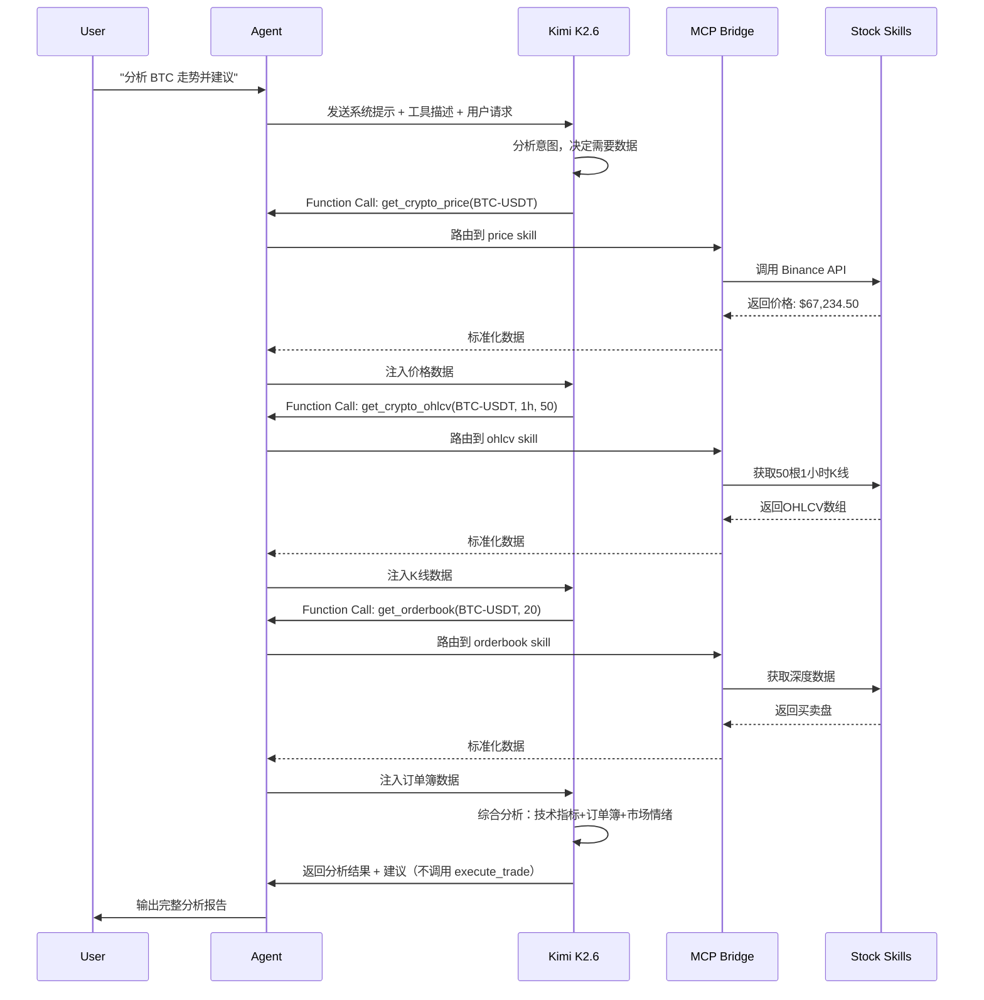

OPENCLAW AGENT 调用LLM大模型，然后LLM直接调用Stock MCP skills访问加密货币数据，然后做决策分析的详细过程。

我来详细分析 OpenClaw Agent 调用 LLM，并通过 MCP 协议访问加密货币数据做决策分析的完整流程。

## 一、整体架构概览

```
┌─────────────────────────────────────────────────────────────────────────┐
│                         OpenClaw Agent System                            │
├─────────────────────────────────────────────────────────────────────────┤
│  User Request → Agent Router → LLM (Kimi K2.6) → MCP Bridge → Skills   │
│                              ↑                    │                      │
│                              └──── Decision ←─────┘                      │
│                                   Analysis                               │
└─────────────────────────────────────────────────────────────────────────┘
```

---

## 二、详细调用流程

### Step 1: 用户请求预处理

当用户输入如 **"分析 BTC 当前走势并给出交易建议"** 时，OpenClaw Agent 首先进行预处理：

```yaml
预处理流程:
  1. 意图识别: 识别为 "crypto_analysis + trading_advice"
  2. 关键词提取: ["BTC", "走势分析", "交易建议"]
  3. 技能匹配: 匹配 Stock MCP Skills 中的相关工具
  4. 上下文注入: 加载用户历史交易偏好、风险等级
```

### Step 2: Agent 构建 MCP 工具描述

Agent 将可用的 Stock MCP Skills 转换为 **Function Calling / Tools** 格式供 LLM 理解：

```json
{
  "tools": [
    {
      "type": "function",
      "function": {
        "name": "get_crypto_price",
        "description": "获取指定加密货币的实时价格数据",
        "parameters": {
          "type": "object",
          "properties": {
            "symbol": {"type": "string", "description": "交易对，如 BTC-USDT"},
            "exchange": {"type": "string", "enum": ["binance", "okx", "bybit"]}
          },
          "required": ["symbol"]
        }
      }
    },
    {
      "type": "function", 
      "function": {
        "name": "get_crypto_ohlcv",
        "description": "获取K线数据用于技术分析",
        "parameters": {
          "type": "object",
          "properties": {
            "symbol": {"type": "string"},
            "interval": {"type": "string", "enum": ["1m","5m","15m","1h","4h","1d"]},
            "limit": {"type": "integer", "default": 100}
          }
        }
      }
    },
    {
      "type": "function",
      "function": {
        "name": "get_orderbook",
        "description": "获取订单簿深度数据",
        "parameters": {
          "type": "object",
          "properties": {
            "symbol": {"type": "string"},
            "depth": {"type": "integer", "default": 20}
          }
        }
      }
    },
    {
      "type": "function",
      "function": {
        "name": "execute_trade",
        "description": "执行交易订单（需要用户确认）",
        "parameters": {
          "type": "object",
          "properties": {
            "symbol": {"type": "string"},
            "side": {"type": "string", "enum": ["buy", "sell"]},
            "type": {"type": "string", "enum": ["market", "limit"]},
            "amount": {"type": "number"}
          }
        }
      }
    }
  ]
}
```

### Step 3: LLM 决策与工具调用循环

这是核心交互流程，LLM 会自主决定调用哪些工具：



### Step 4: MCP Bridge 协议层详解

MCP (Model Context Protocol) 是 OpenClaw 中连接 LLM 与外部工具的标准协议：

```rust
// MCP 消息结构（简化版）
pub struct MCPMessage {
    pub id: Uuid,
    pub skill_name: String,        // "crypto-price", "crypto-ohlcv"
    pub action: String,            // "get_price", "get_klines"
    pub params: serde_json::Value,  // 工具参数
    pub auth: MCPAuth,             // API Key / 签名
    pub timeout: Duration,
}

pub struct MCPResponse {
    pub id: Uuid,
    pub status: MCPStatus,         // Success / Error / Pending
    pub data: serde_json::Value,   // 标准化后的数据
    pub metadata: ResponseMeta,    // 数据源、时间戳、缓存信息
}
```

**数据标准化流程**：
```
Binance API Response → Skill Parser → MCP Standard Format → LLM Context
```

标准化后的数据示例：
```json
{
  "mcp_version": "1.0",
  "skill": "crypto-ohlcv",
  "timestamp": "2026-05-09T22:23:00Z",
  "data": {
    "symbol": "BTC-USDT",
    "interval": "1h",
    "candles": [
      {"t": 1715289600, "o": 67200.0, "h": 67500.0, "l": 66900.0, "c": 67350.0, "v": 1234.5},
      // ... 50根
    ]
  },
  "indicators": {
    "rsi_14": 58.3,
    "macd": {"signal": "bullish", "value": 120.5}
  }
}
```

### Step 5: LLM 决策分析逻辑

Kimi K2.6 在获取数据后，内部处理流程：

```python
# 伪代码表示 LLM 的分析推理过程
def analyze_crypto_data(context):
    # 1. 数据验证
    if not validate_data_freshness(context.data.timestamp):
        request_fresh_data()
    
    # 2. 多维度分析
    technical = analyze_technical_indicators(context.ohlcv)  # RSI, MACD, 布林带
    sentiment = analyze_orderbook(context.orderbook)         # 买卖压力
    trend = identify_trend(context.ohlcv)                    # 趋势判断
    
    # 3. 风险评估
    risk_score = calculate_risk(
        volatility=technical.atr,
        liquidity=orderbook.depth_ratio,
        user_profile=context.user_risk_tolerance
    )
    
    # 4. 决策生成
    if technical.macd_bullish and sentiment.buy_pressure > 0.6 and risk_score < 0.7:
        decision = {
            "action": "suggest_long",
            "confidence": 0.78,
            "entry": technical.support_level,
            "stop_loss": technical.support_level * 0.98,
            "reasoning": "MACD金叉+买盘占优+风险可控"
        }
    else:
        decision = {"action": "hold", "reasoning": "信号冲突，建议观望"}
    
    # 5. 安全校验：交易类工具需二次确认
    if decision.action in ["buy", "sell"]:
        decision.requires_human_approval = True
    
    return decision
```

---

## 三、关键安全机制

| 层级 | 机制 | 说明 |
|------|------|------|
| **权限控制** | 10层权限栈 | `get_crypto_price` (只读) ≠ `execute_trade` (资金风险) |
| **人类确认** | 交易拦截 | LLM 调用 `execute_trade` 时，Agent 强制暂停等待用户确认 |
| **数据验证** | 多源交叉 | 同时查询 Binance + OKX，异常数据告警 |
| **速率限制** | API 节流 | 防止 MCP Skills 被滥用导致 IP 封禁 |
| **审计日志** | 链上存证 | 关键决策哈希上链（基于记忆空间中的 Monad 集成） |

---

## 四、实际交互示例

**用户**: "BTC 现在能买吗？"

**Agent 内部流程**:
1. **工具调用 1**: `get_crypto_price("BTC-USDT")` → `$67,234`
2. **工具调用 2**: `get_crypto_ohlcv("BTC-USDT", "4h", 20)` → 近期震荡下行
3. **工具调用 3**: `get_funding_rate("BTC-USDT")` → 0.01%（多头付费，情绪偏空）

**LLM 推理**:
> 价格处于 4 小时布林带下轨，RSI 38 接近超卖，但资金费率为正且订单簿卖盘深度大于买盘 1.2 倍。短期可能有技术性反弹，但中期趋势偏空。建议：小仓位试多，严格止损 $65,800，或等待放量突破 $68,500 后追涨。

**输出给用户**:
```
📊 BTC-USDT 分析报告
当前价格: $67,234 (-1.2% 24h)
─────────────────────────────
技术指标: RSI 38 (接近超卖) | MACD 死叉第3根
订单簿: 卖盘压力 1.2x | 支撑位 $66,800
资金费率: 0.01% (多头情绪降温)
─────────────────────────────
💡 建议: 观望或轻仓试多
   入场: $67,000-$67,200
   止损: $65,800 (-2.1%)
   目标: $69,500 (+3.4%)
⚠️ 风险提示: 趋势偏弱，严格止损
```

---

&&&&&&&&&&&&&&&&&&&&&&&&&&&&&&&&&&&&&&&&&&&&&&

## 首先进行预处理，交由LLM进行初步的意图识别和任务规划，详细说明细节，包含prompt内容。


我来详细拆解 OpenClaw Agent 的**预处理阶段**，包含完整的 Prompt 工程细节和任务规划机制。

---

## 一、预处理流水线架构

```
┌─────────────────────────────────────────────────────────────────────┐
│                    Pre-processing Pipeline                           │
├─────────────────────────────────────────────────────────────────────┤
│  输入层 → 意图识别 → 任务规划 → 工具匹配 → 上下文组装 → LLM就绪态   │
│   (Raw)   (Intent)   (Plan)    (Match)    (Context)    (Ready)      │
└─────────────────────────────────────────────────────────────────────┘
```

---

## 二、第一层：输入预处理（Input Sanitization）

### 2.1 原始输入捕获

```rust
pub struct RawInput {
    pub content: String,              // "帮我看看BTC现在能不能买，顺便分析一下ETH"
    pub metadata: InputMeta {
        pub user_id: String,          // 用户DID
        pub session_id: String,       // 会话追踪
        pub timestamp: DateTime<Utc>,   // 2026-05-09T23:26:00Z
        pub channel: Channel,         // Web / CLI / API / Webhook
        pub previous_context: Vec<Turn>, // 前5轮对话
    },
    pub attachments: Vec<Attachment>,   // 截图、文件、语音转文本
}
```

### 2.2 文本清洗与标准化

```python
# 预处理函数
def sanitize_input(raw: str) -> CleanedInput:
    # 1. 去除噪声
    cleaned = remove_invisible_chars(raw)  # 零宽字符、控制符
    cleaned = normalize_whitespace(cleaned)  # 多空格→单空格
    
    # 2. 实体识别与标准化
    entities = extract_entities(cleaned)
    # "btc" → "BTC", "比特币" → "BTC", "以太" → "ETH"
    
    # 3. 时间表达式解析
    time_refs = parse_temporal(cleaned)
    # "现在" → 2026-05-09T23:26:00Z
    # "今晚" → 2026-05-09T20:00:00Z (用户本地时区)
    
    # 4. 情感极性检测
    sentiment = detect_sentiment(cleaned)
    # "能不能买" → 犹豫/咨询型 (confidence: 0.82)
    
    return CleanedInput {
        text: cleaned,
        entities: entities,
        temporal_refs: time_refs,
        sentiment: sentiment,
        complexity_score: calculate_complexity(cleaned),  # 0.0-1.0
    }
```

---

## 三、第二层：LLM 意图识别（Intent Recognition）

### 3.1 系统级 Prompt（System Prompt）

```markdown
# ROLE: OpenClaw Intent Analyzer v2.1
你是 OpenClaw Agent 系统的意图分析引擎。你的任务是将用户的自然语言输入解析为结构化的意图图谱，供下游任务规划器使用。

## 核心职责
1. **主意图识别**：确定用户最根本的需求（单主意图原则）
2. **子意图拆分**：识别并行的次要需求
3. **实体提取**：标准化金融实体、时间、数值
4. **情感/ urgency 标记**：判断用户心理状态
5. **歧义标记**：识别模糊表达，标记需澄清点

## 输出格式（严格JSON）
你必须只输出合法的 JSON，不要任何解释文本。

## 意图分类体系（一级→二级→三级）
- **MARKET_ANALYSIS**: 行情分析
  - price_query: 价格查询
  - trend_analysis: 趋势分析  
  - technical_analysis: 技术分析
  - sentiment_analysis: 情绪分析
- **TRADING**: 交易执行
  - trade_suggestion: 交易建议（只分析不执行）
  - trade_execution: 直接下单（高风险，需标记）
  - portfolio_rebalance: 组合再平衡
- **RISK_MANAGEMENT**: 风险管理
  - stop_loss_set: 设置止损
  - position_check: 仓位检查
  - alert_setup: 预警设置
- **INFO_QUERY**: 信息查询
  - project_research: 项目研究
  - news_summary: 新闻摘要
  - onchain_data: 链上数据
- **SYSTEM**: 系统操作
  - skill_install: 安装技能
  - config_update: 配置更新
  - help_request: 帮助请求

## 实体标准化规则
- 加密货币：统一为大写交易对格式（BTC-USDT, ETH-USDC）
- 交易所：binance, okx, bybit, coinbase
- 时间：ISO 8601 格式，附带相对描述
- 金额：统一为 USDT 计价，保留原始币种标注

## 情感标记规则
- urgency: low / medium / high / critical
- confidence: 用户表达的确定程度（0.0-1.0）
- risk_appetite: conservative / moderate / aggressive（从用词推断）

## 歧义处理规则
- 当存在 >2 种合理解释时，标记 ambiguity: true
- 列出可能的解释选项（max 3）
- 建议澄清问题（clarifying_question）

## 安全红线
- 任何涉及资金转移、私钥、助记词的请求 → 标记 security_alert: true
- 交易执行类意图 → 必须标记 requires_human_approval: true
```

### 3.2 用户输入包装（User Prompt）

```markdown
## 用户输入
"帮我看看BTC现在能不能买，顺便分析一下ETH，最近跌太多了心里慌"

## 会话上下文
- 用户ID: did:monad:0x7a3f...e9b2
- 风险等级: moderate（历史设置）
- 持仓: BTC 0.5枚, ETH 12枚（来自记忆系统）
- 前序对话: 3小时前询问过"什么时候抄底"
- 当前市场状态: BTC 24h -5.2%, ETH 24h -8.1%

## 请输出意图分析结果
```

### 3.3 LLM 输出示例（意图识别结果）

```json
{
  "version": "2.1",
  "request_id": "req_9f8e7d6c5b4a",
  "timestamp": "2026-05-09T23:26:15Z",
  
  "primary_intent": {
    "category": "TRADING",
    "subcategory": "trade_suggestion",
    "confidence": 0.91,
    "description": "用户寻求BTC买入时机建议"
  },
  
  "secondary_intents": [
    {
      "category": "MARKET_ANALYSIS",
      "subcategory": "trend_analysis",
      "confidence": 0.85,
      "description": "ETH趋势分析请求",
      "dependency": "parallel"  
    },
    {
      "category": "RISK_MANAGEMENT",
      "subcategory": "position_check",
      "confidence": 0.72,
      "description": "隐含持仓焦虑，需心理安抚+仓位评估",
      "dependency": "implicit"
    }
  ],
  
  "entities": [
    {
      "type": "crypto_symbol",
      "raw": "BTC",
      "normalized": "BTC-USDT",
      "role": "primary_target"
    },
    {
      "type": "crypto_symbol", 
      "raw": "ETH",
      "normalized": "ETH-USDT",
      "role": "secondary_target"
    },
    {
      "type": "temporal",
      "raw": "现在",
      "normalized": "2026-05-09T23:26:00Z",
      "granularity": "immediate"
    },
    {
      "type": "sentiment_indicator",
      "raw": "跌太多了心里慌",
      "polarity": "fear",
      "intensity": 0.78
    }
  ],
  
  "user_state": {
    "urgency": "medium",
    "confidence": 0.35,
    "risk_appetite": "moderate",
    "emotional_state": "anxious_fomo_fear",
    "financial_stress": 0.65
  },
  
  "ambiguity": {
    "exists": false,
    "score": 0.12
  },
  
  "security": {
    "security_alert": false,
    "requires_human_approval": false,
    "sensitive_data_detected": false
  },
  
  "context_hints": [
    "用户3小时前询问'抄底'，当前继续询问买入时机，可能存在FOMO倾向",
    "ETH跌幅(-8.1%)大于BTC(-5.2%)，用户持仓ETH较多，焦虑合理",
    "建议分析中纳入仓位占比和心理安抚"
  ]
}
```

---

## 四、第三层：任务规划（Task Planning）

### 4.1 系统级 Prompt（Planner System Prompt）

```markdown
# ROLE: OpenClaw Task Planner v2.1
你是 OpenClaw 的任务规划引擎。基于意图分析结果，你需要生成一个可执行、可追踪、可回滚的任务计划。

## 核心职责
1. **任务分解**：将复合意图拆分为原子任务节点
2. **依赖排序**：确定任务执行顺序（串行/并行/条件分支）
3. **工具映射**：为每个任务匹配最优 MCP Skill
4. **资源预算**：预估 API 调用次数、Token 消耗、执行时间
5. **失败策略**：定义每个任务的降级方案和重试逻辑

## 任务节点规范
每个任务必须包含：
- task_id: 唯一标识
- type: data_fetch | analysis | decision | action | human_approval
- skill: 对应的 MCP Skill 名称
- input_schema: 输入参数模板
- output_schema: 期望输出格式
- dependencies: 前置任务ID列表
- fallback: 失败时的替代方案

## 执行策略
- **并行最大化**：无依赖的数据获取任务并行执行
- **短路优化**：若早期任务结果已能确定最终结论，提前终止
- **缓存感知**：检查记忆系统是否有可用缓存数据

## 输出格式（JSON）
严格输出任务计划图，包含 DAG 结构。
```

### 4.2 任务规划输入（基于上文意图结果）

```markdown
## 意图分析结果
[上文JSON输出]

## 可用 MCP Skills 清单
1. crypto_price: 实时价格（延迟<1s，免费额度1000/天）
2. crypto_ohlcv: K线数据（支持1m-1M，Binance/OKX）
3. crypto_orderbook: 订单簿深度（20档/100档/全量）
4. crypto_funding_rate: 资金费率（8h周期）
5. crypto_onchain: 链上数据（大额转账、交易所流入流出）
6. technical_indicators: 技术指标计算（RSI/MACD/布林带/ATR）
7. sentiment_analysis: 市场情绪（多空比、恐惧贪婪指数）
8. portfolio_analyzer: 持仓分析（盈亏、占比、风险敞口）
9. trade_simulator: 交易模拟（不执行真实交易）
10. alert_manager: 预警设置

## 用户记忆片段
- 偏好时间框架: 4h > 1d > 1h
- 常用指标: MACD, RSI, 成交量
- 上次交易: 3天前，ETH止损离场
- 心理价位: BTC $65k 视为强支撑

## 请生成任务计划
```

### 4.3 LLM 输出：任务计划 DAG

```json
{
  "plan_id": "plan_a1b2c3d4",
  "version": "2.1",
  "estimated_duration_ms": 3500,
  "estimated_tokens": 4500,
  
  "tasks": {
    "T1": {
      "task_id": "T1",
      "name": "fetch_btc_price",
      "type": "data_fetch",
      "skill": "crypto_price",
      "description": "获取BTC实时价格",
      "input": {"symbol": "BTC-USDT", "exchange": "binance"},
      "output_schema": {"price": "float", "change_24h": "float", "timestamp": "iso"},
      "dependencies": [],
      "parallel_group": "group_a",
      "fallback": {"skill": "crypto_price", "params": {"exchange": "okx"}},
      "max_retries": 2,
      "timeout_ms": 3000
    },
    
    "T2": {
      "task_id": "T2", 
      "name": "fetch_eth_price",
      "type": "data_fetch",
      "skill": "crypto_price",
      "description": "获取ETH实时价格",
      "input": {"symbol": "ETH-USDT", "exchange": "binance"},
      "output_schema": {"price": "float", "change_24h": "float", "timestamp": "iso"},
      "dependencies": [],
      "parallel_group": "group_a",
      "fallback": {"skill": "crypto_price", "params": {"exchange": "okx"}},
      "max_retries": 2,
      "timeout_ms": 3000
    },
    
    "T3": {
      "task_id": "T3",
      "name": "fetch_btc_ohlcv",
      "type": "data_fetch", 
      "skill": "crypto_ohlcv",
      "description": "获取BTC 4h K线（用户偏好）",
      "input": {"symbol": "BTC-USDT", "interval": "4h", "limit": 50, "exchange": "binance"},
      "output_schema": {"candles": "array[OHLCV]"},
      "dependencies": [],
      "parallel_group": "group_a",
      "fallback": null,
      "max_retries": 1,
      "timeout_ms": 5000
    },
    
    "T4": {
      "task_id": "T4",
      "name": "fetch_eth_ohlcv",
      "type": "data_fetch",
      "skill": "crypto_ohlcv", 
      "description": "获取ETH 4h K线",
      "input": {"symbol": "ETH-USDT", "interval": "4h", "limit": 50, "exchange": "binance"},
      "output_schema": {"candles": "array[OHLCV]"},
      "dependencies": [],
      "parallel_group": "group_a",
      "fallback": null,
      "max_retries": 1,
      "timeout_ms": 5000
    },
    
    "T5": {
      "task_id": "T5",
      "name": "fetch_orderbook_btc",
      "type": "data_fetch",
      "skill": "crypto_orderbook",
      "description": "获取BTC订单簿深度",
      "input": {"symbol": "BTC-USDT", "depth": 50, "exchange": "binance"},
      "output_schema": {"bids": "array[price,amount]", "asks": "array[price,amount]", "spread": "float"},
      "dependencies": [],
      "parallel_group": "group_a",
      "fallback": null,
      "max_retries": 1,
      "timeout_ms": 3000
    },
    
    "T6": {
      "task_id": "T6",
      "name": "fetch_funding_rates",
      "type": "data_fetch",
      "skill": "crypto_funding_rate",
      "description": "获取资金费率（判断市场情绪）",
      "input": {"symbols": ["BTC-USDT", "ETH-USDT"], "exchange": "binance"},
      "output_schema": {"rates": "array[symbol,rate,nextFundingTime]"},
      "dependencies": [],
      "parallel_group": "group_a",
      "fallback": null,
      "max_retries": 1,
      "timeout_ms": 3000
    },
    
    "T7": {
      "task_id": "T7",
      "name": "calculate_technical_btc",
      "type": "analysis",
      "skill": "technical_indicators",
      "description": "BTC技术指标计算",
      "input": {
        "candles_ref": "T3.output.candles",
        "indicators": ["RSI(14)", "MACD(12,26,9)", "BB(20,2)", "ATR(14)", "Volume_MA(20)"]
      },
      "output_schema": {"rsi": "float", "macd": "object", "bb": "object", "atr": "float", "vol_ma": "float"},
      "dependencies": ["T3"],
      "parallel_group": "group_b",
      "fallback": {"type": "simplified", "indicators": ["RSI", "MA"]},
      "max_retries": 1,
      "timeout_ms": 2000
    },
    
    "T8": {
      "task_id": "T8",
      "name": "calculate_technical_eth",
      "type": "analysis",
      "skill": "technical_indicators",
      "description": "ETH技术指标计算",
      "input": {
        "candles_ref": "T4.output.candles", 
        "indicators": ["RSI(14)", "MACD(12,26,9)", "BB(20,2)", "ATR(14)"]
      },
      "output_schema": {"rsi": "float", "macd": "object", "bb": "object", "atr": "float"},
      "dependencies": ["T4"],
      "parallel_group": "group_b",
      "fallback": {"type": "simplified", "indicators": ["RSI", "MA"]},
      "max_retries": 1,
      "timeout_ms": 2000
    },
    
    "T9": {
      "task_id": "T9",
      "name": "analyze_sentiment",
      "type": "analysis",
      "skill": "sentiment_analysis",
      "description": "市场情绪综合分析",
      "input": {
        "funding_ref": "T6.output",
        "orderbook_ref": "T5.output",
        "symbols": ["BTC", "ETH"]
      },
      "output_schema": {"fear_greed_index": "int", "long_short_ratio": "float", "social_sentiment": "string"},
      "dependencies": ["T5", "T6"],
      "parallel_group": "group_b",
      "fallback": {"type": "static", "use_cached": true},
      "max_retries": 1,
      "timeout_ms": 4000
    },
    
    "T10": {
      "task_id": "T10",
      "name": "portfolio_check",
      "type": "analysis",
      "skill": "portfolio_analyzer",
      "description": "用户持仓风险分析",
      "input": {
        "user_id": "did:monad:0x7a3f...e9b2",
        "current_prices_ref": {"btc": "T1.output", "eth": "T2.output"}
      },
      "output_schema": {"total_pnl": "float", "btc_ratio": "float", "eth_ratio": "float", "risk_score": "float"},
      "dependencies": ["T1", "T2"],
      "parallel_group": "group_b",
      "fallback": null,
      "max_retries": 1,
      "timeout_ms": 2000
    },
    
    "T11": {
      "task_id": "T11",
      "name": "synthesize_analysis",
      "type": "analysis",
      "skill": "llm_reasoning",  
      "description": "综合分析与决策生成（核心推理任务）",
      "input": {
        "technical_btc": "T7.output",
        "technical_eth": "T8.output",
        "sentiment": "T9.output",
        "portfolio": "T10.output",
        "user_state": {"risk_appetite": "moderate", "emotional_state": "anxious", "psychological_support": 65000},
        "query_type": "trade_suggestion"
      },
      "output_schema": {
        "btc_verdict": "string",
        "eth_verdict": "string", 
        "confidence": "float",
        "action": "hold|buy_partial|buy_full|sell|set_alert",
        "reasoning": "string",
        "risk_warnings": "array[string]",
        "psychological_support": "string"
      },
      "dependencies": ["T7", "T8", "T9", "T10"],
      "parallel_group": null,
      "fallback": {"type": "degraded", "exclude": ["T9", "T10"]},
      "max_retries": 0,
      "timeout_ms": 10000,
      "llm_config": {
        "model": "kimi-k2.6",
        "mode": "reasoning",  // 使用思考模式
        "temperature": 0.3,
        "max_tokens": 4000
      }
    }
  },
  
  "execution_graph": {
    "parallel_groups": [
      {
        "id": "group_a",
        "name": "data_fetch_wave",
        "tasks": ["T1", "T2", "T3", "T4", "T5", "T6"],
        "max_concurrency": 6,
        "timeout_ms": 6000
      },
      {
        "id": "group_b", 
        "name": "analysis_wave",
        "tasks": ["T7", "T8", "T9", "T10"],
        "max_concurrency": 4,
        "timeout_ms": 5000
      }
    ],
    "critical_path": ["T3/T4", "T7/T8", "T11"],
    "shortcuts": [
      {
        "condition": "T1.output.change_24h > +15% OR T1.output.change_24h < -20%",
        "action": "trigger_alert_only",
        "skip_tasks": ["T3", "T4", "T7", "T8", "T9"],
        "reason": "极端行情下技术分析失效，直接告警"
      }
    ]
  },
  
  "quality_gates": [
    {
      "stage": "post_group_a",
      "check": "data_freshness",
      "threshold": "timestamp < 30s ago",
      "failure_action": "retry_or_degrade"
    },
    {
      "stage": "post_T11", 
      "check": "confidence_threshold",
      "threshold": "T11.output.confidence > 0.6",
      "failure_action": "request_more_data"
    }
  ]
}
```

---

## 五、第四层：上下文组装（Context Assembly）

### 5.1 动态 Prompt 构建

```rust
pub fn assemble_llm_context(
    plan: &TaskPlan,
    task_results: &HashMap<String, TaskOutput>,
    user_memory: &UserMemory,
) -> LLMContext {
    
    let mut context = LLMContext::new();
    
    // 1. 系统提示（角色+约束）
    context.system = build_system_prompt(
        role: "Crypto Trading Advisor",
        constraints: vec![
            "不得提供具体投资建议，仅作信息分析",
            "必须提示风险",
            "考虑用户情绪状态",
        ],
        tools: get_available_tools_for_task(&plan),
    );
    
    // 2. 记忆注入（RAG检索）
    context.memories = retrieve_relevant_memories(
        query: &plan.primary_intent.description,
        top_k: 5,
        recency_boost: true,
    );
    
    // 3. 实时数据注入（来自已完成任务）
    context.data = task_results.iter().map(|(id, output)| {
        format!("## {} 结果\n{}\n", id, output.to_markdown())
    }).collect();
    
    // 4. 用户画像注入
    context.user_profile = format!(
        "用户风险等级: {}\n持仓情况: {}\n心理价位: {}\n历史偏好: {}",
        user_memory.risk_level,
        user_memory.positions,
        user_memory.psychological_prices,
        user_memory.indicator_preferences,
    );
    
    // 5. 当前任务提示
    context.current_task = plan.tasks.get("T11").unwrap(); // 合成分析任务
    
    context
}
```

### 5.2 最终提交给 LLM 的完整 Prompt

```markdown
<system>
你是 OpenClaw 的加密货币分析助手。你正在协助一位风险等级为"稳健型"的用户。
当前市场波动剧烈，用户情绪焦虑。请提供客观分析，必须包含风险提示。
</system>

<memory>
[相关记忆片段]
- 2026-05-06: 用户询问"ETH什么时候能回本"，当时ETH持仓成本$3,200，现价$2,850
- 2026-05-08: 用户设置BTC $65,000 价格提醒
- 用户偏好指标: MACD, RSI, 4小时周期
</memory>

<data>
## T1: BTC实时价格
- 当前价格: $67,234.50
- 24h涨跌: -5.2%
- 更新时间: 2026-05-09T23:26:00Z

## T2: ETH实时价格  
- 当前价格: $2,680.00
- 24h涨跌: -8.1%
- 更新时间: 2026-05-09T23:26:00Z

## T7: BTC技术指标 (4h周期, 50根K线)
- RSI(14): 32.4 (接近超卖)
- MACD: -45.2, Signal: -38.1, Histogram: -7.1 (空头延续)
- 布林带: 下轨$66,800, 中轨$69,500, 上轨$72,200 (价格贴下轨)
- ATR(14): $1,240 (波动率中等偏高)
- 成交量MA20: 当前成交量为均量1.3倍 (放量下跌)

## T8: ETH技术指标 (4h周期, 50根K线)
- RSI(14): 28.7 (超卖区域)
- MACD: -12.8, Signal: -10.2, Histogram: -2.6 (空头延续)
- 布林带: 下轨$2,650, 中轨$2,920, 上轨$3,190 (跌破下轨)
- ATR(14): $85 (波动率较高)

## T9: 市场情绪
- 恐惧贪婪指数: 22 (极度恐惧)
- BTC多空比: 0.78 (空头占优)
- ETH多空比: 0.65 (空头强势)
- 资金费率: BTC 0.01%, ETH 0.03% (均多头付费，偏空)

## T10: 持仓分析
- 总资产: $45,600 (USDT计价)
- BTC持仓: 0.5枚, 成本$64,000, 当前浮亏: -$1,383 (-4.3%)
- ETH持仓: 12枚, 成本$3,200, 当前浮亏: -$6,240 (-16.2%)
- ETH占比: 70.5% (过度集中)
- 整体风险评分: 7.2/10 (偏高)
</data>

<user_state>
- 情绪状态: 焦虑/恐慌 (检测到"心里慌")
- 风险承受: 中等
- 经验水平: 1年 (中等)
- 当前痛点: ETH重仓深套，急于解套
</user_state>

<task>
基于以上数据，请完成以下分析并输出结构化结果：

1. **BTC分析**: 当前是否适合买入？给出具体价位区间建议
2. **ETH分析**: 当前走势判断，对持仓用户的心理建议
3. **仓位诊断**: 当前持仓结构是否合理？给出调整建议
4. **情绪安抚**: 针对用户焦虑状态，提供理性视角
5. **风险提示**: 必须列出3条以上风险警示

输出要求:
- 使用中文，专业但易懂
- 每个结论必须有数据支撑
- 避免绝对化表述（用"可能"、"建议"等）
- 最后必须包含免责声明
</task>
```

---

## 六、执行与监控

### 6.1 任务调度器执行流程

```rust
async fn execute_plan(plan: TaskPlan) -> Result<ExecutionReport> {
    let mut executor = DagExecutor::new();
    let mut results = HashMap::new();
    
    // 阶段1: 并行数据获取 (group_a)
    let group_a_tasks = plan.get_group("group_a");
    let data_futures = group_a_tasks.iter().map(|t| {
        execute_with_timeout(t, t.timeout_ms, t.max_retries)
    });
    let data_results = join_all(data_futures).await;
    
    // 质量门检查
    quality_gate_check("post_group_a", &data_results)?;
    
    // 阶段2: 并行分析 (group_b)  
    let group_b_tasks = plan.get_group("group_b");
    let analysis_futures = group_b_tasks.iter().map(|t| {
        let deps = t.dependencies.iter().map(|d| results.get(d).unwrap());
        execute_with_deps(t, deps)
    });
    let analysis_results = join_all(analysis_futures).await;
    
    // 阶段3: 综合推理 (T11) - 调用LLM
    let t11 = plan.tasks.get("T11").unwrap();
    let llm_context = assemble_llm_context(&plan, &results, &user_memory);
    let final_analysis = call_llm(
        model: t11.llm_config.model,
        mode: t11.llm_config.mode,  // reasoning模式
        context: llm_context,
    ).await?;
    
    // 结果缓存与存证
    cache_result(&final_analysis);
    attest_on_chain(&final_analysis.hash()).await;  // Layer 4 区块链存证
    
    Ok(ExecutionReport {
        tasks_executed: results.len(),
        duration_ms: timer.elapsed(),
        llm_tokens_used: final_analysis.token_usage,
        data_sources: extract_sources(&results),
        final_output: final_analysis,
    })
}
```

---

## 七、Prompt 工程关键设计原则

| 原则 | 实现方式 | 目的 |
|------|----------|------|
| **分层隔离** | System / Memory / Data / Task 分离 | 防止提示注入，便于调试 |
| **数据标准化** | MCP 统一输出格式 | LLM 无需适配多源异构数据 |
| **动态上下文窗口** | 根据 Token 预算智能裁剪记忆 | 避免超出上下文限制 |
| **思维链触发** | T11 任务强制使用 reasoning 模式 | 复杂决策需要深度推理 |
| **安全护栏** | System 层植入约束，输出层过滤 | 防止投资建议合规风险 |
| **可观测性** | 每个 Prompt 附带 request_id | 全链路追踪与审计 |

---


